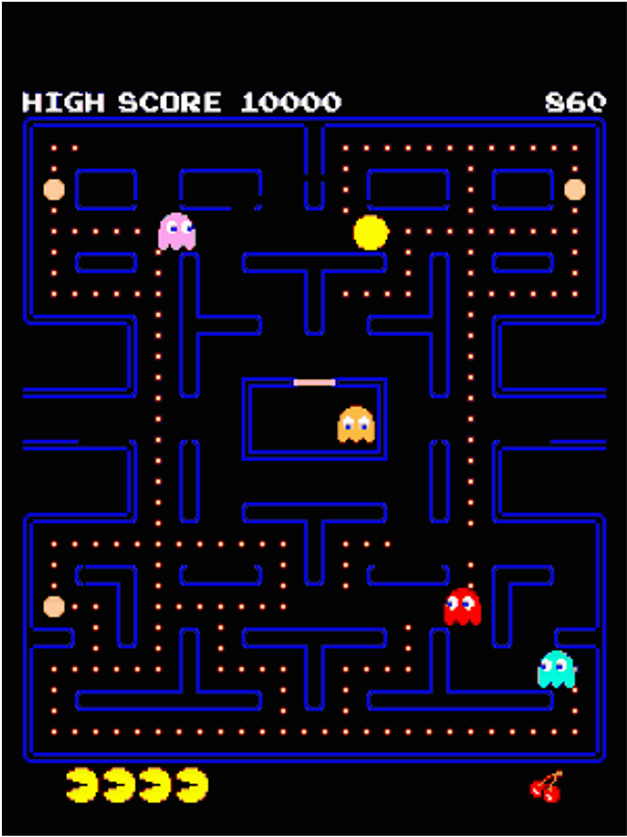
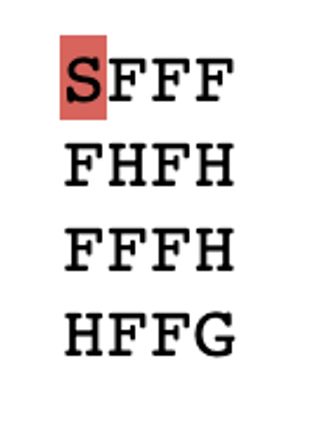
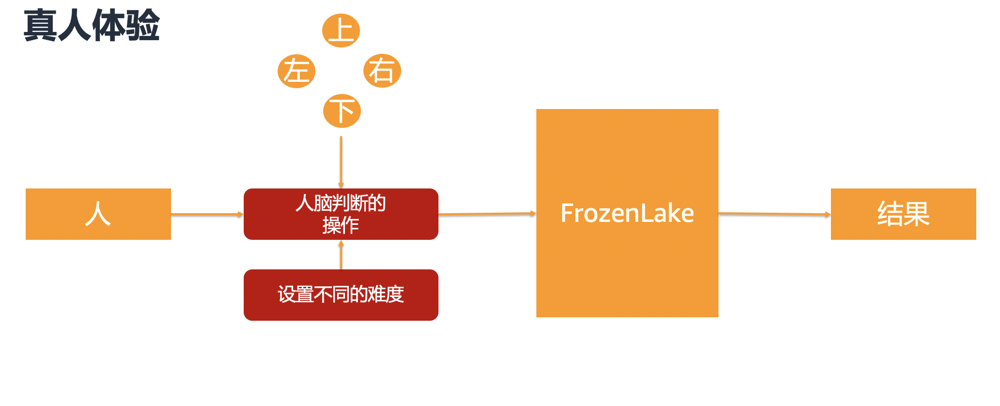
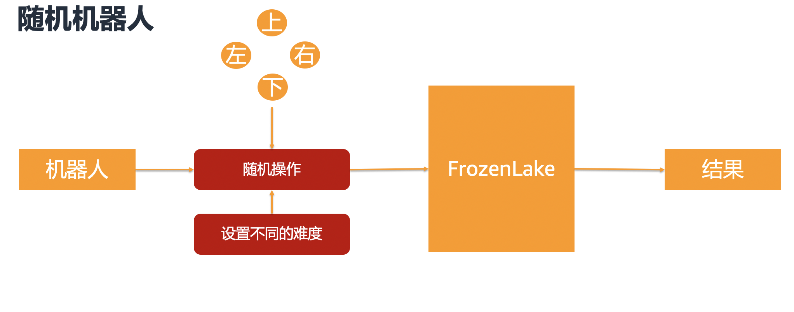
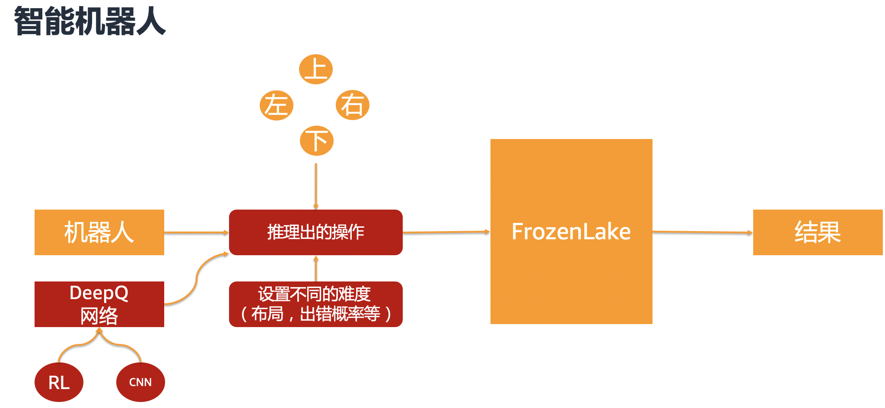

# 基于强化学习实现游戏关卡平衡解决方案
## 目录
* 游戏关卡平衡介绍
* 强化学习介绍
* 实验架构
* 实验步骤
## 游戏关卡平衡介绍
在游戏的设计和测试阶段都会考虑如何设计关卡来满足游戏推广的需要，关卡的设计太难或者太简单对玩家的体验和游戏的推广由很大的影响。
* 关卡设计是创造出色游戏的重要组成部分
* 关卡太难，玩家会感到沮丧并停止比赛
* 关卡太简单了，玩家会感到无聊并停止游戏
* 当添加新的关卡时，以客观、可量化的方式确保公平
* 尽可能实现流程的自动化，以便快速交付。无需花费数小时手动验证、测试和微调关卡设计，而是通过强化学习自动化流程。
在此背景下有没有一种方法可以进行自动化的游戏关卡平衡设计策略，而不是等待到游戏上线后再进行调整呢，下来介绍一下如何使用强化学习实现关卡平衡。
## 强化学习介绍
RL（Reinforcement Learning） 基于称为马尔可夫决策过程 (MDP) 的模型。 MDP 由一系时间步骤组成。 每个时间步骤由以下组成：
* Environment（环境）
* State（状态）
* Action（行为）
* Reward（奖励）
* Observation（观察）
* Agent(代理)
<!-- 
{:height="40px" width="30px"} -->
 
 
下面举一个吃豆人（Pac Man）游戏的例子(如上图)：
* Agent：计算机控制什么（吃豆人）
* State：游戏中的当前状态（吃豆人中的每一帧）
* Action：代理做出的决定（吃豆人向左或向右移动）
* Reward：代理试图最大化的值（ 吃豆人 获得的分数）

当吃豆人吃豆子的过程中根据其当前状态所处的环境，已吃到豆子最多为奖励机制，在此背景下吃豆人可以通过强化学习算法进行训练，最终训练一个能够获得高分的吃豆机器人。吃豆人在每次决策下一步动作时（Action）通过模型推理出下一步应该如何做可以获得更高的分数。
在本次实验中我们将以一个简单的小游戏进行，介绍如何使用RL实现关卡的平衡设计，本次实验使用DeepQ网络进行训练。
## DeepQ 网络介绍
Deep Learning + Reinforcement Learning = Deep-Q-Networks

Q Value 指的是Deep-Q-Networks 中的 Q，是一个动作在特定状态下的 “质量”。 如果一个动作具有很高的预期长期价值，那么它就是高质量的。
本实验为了简化将游戏的环境设置为一个矩阵，在真实游戏中比如上文提到的吃豆人游戏需要根据吃豆人的每一帧的图片信息获取当前状态，这种场景需要借助卷积神经网络来协助处理图片，从而获取照片中是否有吃豆人，以及他的位置。
## 实验游戏介绍

 
如上图所示
S：代表起点
F：代表冰面
H：代表陷阱
G：代表目的地
 
规则是从起点开始，不掉进陷阱，同时成功到达目的地。 
游戏难度通过增加冰面的易滑倒概率来增加难度，后面训练时会通过增加出错的概率
## 实验内容介绍
本实验均通过notebook中代码进行执行，详见 game-leveling-notebook.ipynb
实验内容分为三部分

* 真人体验游戏 ： 您可以通过notebook中的UI组件尝试游戏

* 随机机器人：通过随机机器人进行游戏测试，查看通关率情况

* 智能机器人：经过RL学习的机器人，查看通关率情况，根据设置不同难度，同时查看通关率，根据游戏的预期选择合适的通关率对应的难度设计策略。

在本实验中，您将训练强化学习 (RL) Agent 来玩名为 *Frozen Lake* 的简单文本游戏。然后，你将使用该代理来评估多个随机生成的关卡的难度 。这种方法同样适用于其他游戏场景。

## 环境准备
1. 创建Sagemaker notebook实例
2. 导入本文中的 game-leveling-notebook.ipynb 文件
3. 运行noteboo代码
## 实验步骤
具体步骤如下：
实验最后我们会使用Sagemaker进行模型训练，特别是使用Sagemaker的自动抄参数优化功能帮助您选择最佳的模型参数，减少尝试贺实验的过程成本。
* 在 OpenAI Gym 中测试游戏
* 使用随机代理，测试基准数据
* 在本地构建和训练机器人
* 通过SageMaker 训练并优化找到最佳模型
## 总结
尽管本实验是一个非常简单的游戏，但是针对其他更复杂的游戏也可以使用该方案进行验证，其中区别主要在于环境的复杂度，Agent的数量以及状态获取的预处理等，核心的强化学习原理是相通的。

## Unity ML Agent方式如何与Sagemaekr集成
针对使用Unity ML Agent的场景可以参考notebook进行实验。
https://sagemaker-workshop-ke9u.notebook.us-west-2.sagemaker.aws/notebooks/rl_unity_ray_2021-11-12/rl_unity_ray.ipynb

